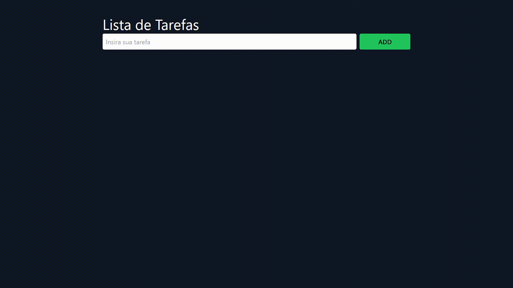

<h1 align="center">Lista de Tarefas</h1>

<p>

---
<a href="https://to-do-list-victorozoterio.vercel.app/" target="_blank">
        
</a>

<p align="center">Clique <a href="https://to-do-list-victorozoterio.vercel.app/" target="_blank">aqui</a> para abrir o site da aplicação!</p>

---

## 📚 Descrição

App To Do List, desenvolvido em React.js & TypeScript.

## 🏃 Rodando o aplicativo

```bash
# Clone o repositório:
git clone git@github.com:victorozoterio/to-do-list-frontend.git

# Execute o comando:
npm run start:dev

# Abra a aplicação acessando a seguinte URL:
http://localhost:5173/
```